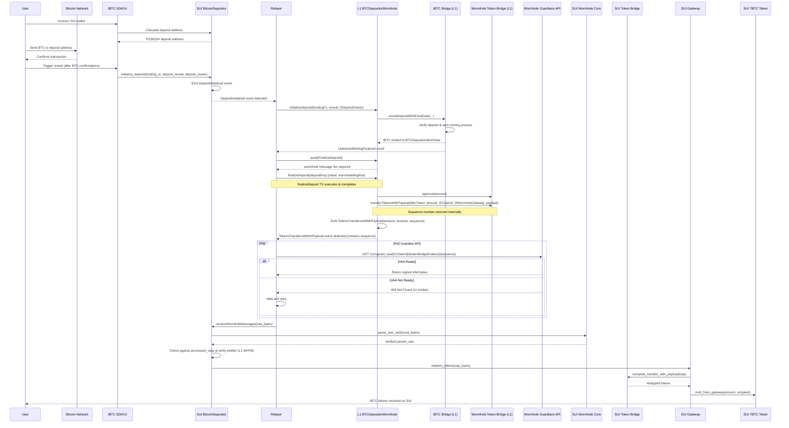

# tBTC Cross-Chain Sequence Diagram: Ethereum to Sui VAA Relay (using BTCDepositorWormhole)

The following sequence diagram illustrates the complete flow of a deposit from Bitcoin to Sui through the cross-chain relayer, using the `BTCDepositorWormhole` L1 contract.



## Key VAA Message Flow (using BTCDepositorWormhole)

The Wormhole VAA relay process, driven by the off-chain relayer listening to L1 events:

```mermaid
flowchart TD
    A[Relayer calls L1BTCDepositorWormhole.finalizeDeposit] --> B{finalizeDeposit TX Confirmed?}
    B -->|Yes| C[Relayer waits for TokensTransferredWithPayload event]
    C --> D[Extract Sequence from event]
    D --> E[Relayer polls Guardian API with sequence]
    E --> F{VAA Available?}
    F -->|Yes| G[Relayer receives signed VAA bytes]
    F -->|No| E
    G --> H[Relayer submits Sui TX: BitcoinDepositor.receiveWormholeMessages(VAA)]
    H --> I[SUI Wormhole Core verifies VAA]
    I --> J[BitcoinDepositor checks replay & emitter]
    J --> K[Gateway.redeem_tokens called with VAA]
    K --> L[SUI Token Bridge processes transfer]
    L --> M[Canonical tBTC minted to user]

    B -->|No/Error| N[Relayer handles L1 TX error]
```

## Implementation Notes (Final)

1.  **L1 Contract:** `BTCDepositorWormhole.sol` is used on L1.
2.  **VAA Payload Format**: The payload contains the `l2DepositOwner` address (Sui address) in Wormhole `bytes32` format, encoded using `abi.encodePacked`. The Sui Gateway must decode this.
3.  **Trusted Emitter**: The Sui `BitcoinDepositor.ReceiverState.trusted_emitter` must be set to the **L1 Wormhole Token Bridge address**.
4.  **Sequence Numbers**: The `TokensTransferredWithPayload` event emitted by `BTCDepositorWormhole` provides the sequence number needed by the relayer to fetch the VAA.
5.  **VAA Fetch & Submit**: This is an **off-chain relayer responsibility**. The relayer listens for the L1 event, polls the Guardian API, and submits the VAA via a Sui transaction (paying SUI gas).
6.  **Fee Structure:**
    - The caller of `finalizeDeposit` on L1 pays the base `wormhole.messageFee()`.
    - The Relayer pays the gas fee in SUI for the `receiveWormholeMessages` transaction.
7.  **Verification Flow**: Similar to before, but emphasizes the event-driven trigger:
    - Relayer verifies L1 `finalizeDeposit` success.
    - Relayer receives `TokensTransferredWithPayload` event.
    - Relayer fetches VAA using correct sequence/emitter from event.
    - Sui Wormhole Core verifies VAA signatures.
    - Sui BitcoinDepositor verifies the emitter chain/address and checks for replay.
    - Sui Gateway handles final token bridge payload parsing and redemption.
